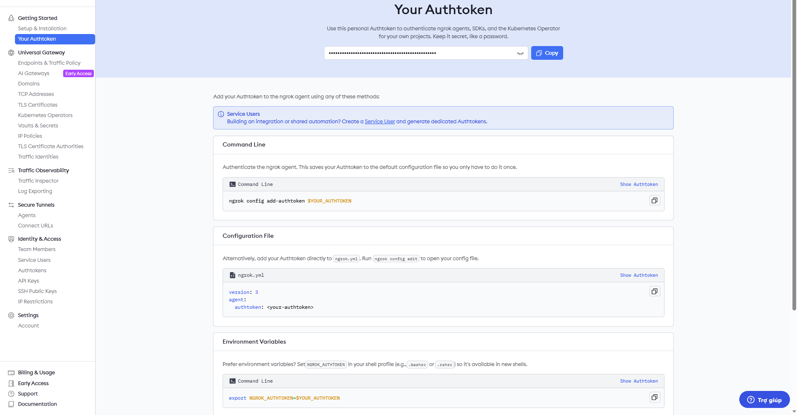

# 👗 ClosetHub

**Dự án 1 (PRO1122)** — Ứng dụng Bán Quần Áo

---

## 🛍️ Giới thiệu

**ClosetHub** là ứng dụng **bán và quản lý quần áo thời trang**, giúp người dùng dễ dàng **xem, chọn mua, và quản lý sản phẩm** ngay trên điện thoại.  
Ứng dụng hướng đến trải nghiệm mua sắm tiện lợi, hiện đại, phù hợp với các cửa hàng hoặc cá nhân kinh doanh thời trang.

---

## ✨ Tính năng chính

### 📱 App Android (Người dùng)

- 👤 **Quản lý tài khoản**: Đăng ký, đăng nhập, cập nhật thông tin cá nhân
- 🧥 **Xem sản phẩm**: Danh sách sản phẩm, sản phẩm theo danh mục, top sản phẩm bán chạy, chi tiết sản phẩm
- 🔍 **Tìm kiếm và lọc**: Tìm kiếm sản phẩm theo tên, lọc theo danh mục
- ❤️ **Yêu thích**: Thêm/xóa sản phẩm yêu thích, xem danh sách yêu thích
- 🛒 **Giỏ hàng**: Thêm vào giỏ hàng, cập nhật số lượng, xóa sản phẩm
- 💳 **Đặt hàng**: Đặt hàng và xem lịch sử đơn hàng
- 💰 **Ví điện tử**: Tạo ví, nạp/rút tiền, xem lịch sử giao dịch, đổi PIN
- 🎨 **Banner**: Xem banner khuyến mãi

### 💻 Web Admin Panel

- 📊 **Dashboard**: Tổng quan hệ thống
- 📦 **Quản lý sản phẩm**: Thêm, sửa, xóa sản phẩm và biến thể (variants)
- 📁 **Quản lý danh mục**: Thêm, xóa danh mục sản phẩm
- 📋 **Quản lý đơn hàng**: Xem danh sách đơn hàng, cập nhật trạng thái
- 👥 **Quản lý khách hàng**: Xem danh sách và chi tiết khách hàng
- 🎨 **Quản lý banner**: Thêm, sửa, xóa banner khuyến mãi
- 📈 **Thống kê**: Thống kê doanh thu theo khoảng thời gian, top sản phẩm bán chạy, biểu đồ doanh thu

---

## 🧩 Cấu trúc dự án

Dự án gồm **3 phần chính**:

### 1. 📱 App Android (ClosetHub Mobile)

- Phát triển bằng **Android Studio (Java)**
- Giao diện thân thiện, dễ sử dụng
- Kết nối đến server qua **RESTful API**
- Thư mục: `app/`

### 2. 💻 Server (ClosetHub API)

- Xây dựng bằng **Node.js + Express + MongoDB**
- Quản lý dữ liệu sản phẩm, tài khoản người dùng, giỏ hàng, đơn hàng
- Cung cấp **RESTful API** cho ứng dụng Android và Web Admin
- Thư mục: `server/`
- Cấu trúc:
  - `controllers/` - Xử lý logic nghiệp vụ
  - `models/` - Định nghĩa schema MongoDB
  - `routes/` - Định nghĩa API routes
  - `middleware/` - Authentication & Authorization
  - `views/` - EJS templates cho Web Admin
  - `public/` - Static files (images, CSS, JS)

### 3. 🌐 Web Admin Panel

- Giao diện quản trị web được xây dựng bằng **EJS templates**
- Quản lý toàn bộ hệ thống: sản phẩm, đơn hàng, khách hàng, thống kê
- Truy cập tại: `http://localhost:3000/login/*`
- Thư mục: `server/views/`

---

## 🧠 Công nghệ sử dụng

| Thành phần         | Công nghệ                            |
| ------------------ | ------------------------------------ |
| **Ngôn ngữ**       | Java (Android), JavaScript (Node.js) |
| **Cơ sở dữ liệu**  | MongoDB                              |
| **Backend**        | Node.js + Express                    |
| **Frontend (App)** | Android Studio (Java)                |
| **Frontend (Web)** | EJS Templates + Tailwind CSS         |
| **API**            | RESTful API                          |
| **Authentication** | JWT (JSON Web Token)                 |
| **File Upload**     | Multer                               |
| **Charts**         | Chart.js                             |

---

## 🚀 Mục tiêu dự án

- Xây dựng ứng dụng bán quần áo tiện lợi, dễ sử dụng
- Giúp người bán dễ dàng quản lý sản phẩm và đơn hàng
- Cải thiện trải nghiệm mua sắm của người dùng thông qua giao diện thân thiện và dữ liệu được đồng bộ theo thời gian thực

---

## ⚙️ Hướng dẫn cài đặt (tùy chọn)

### 🔹 1. Clone dự án

```bash
npm install -g nodemon
git clone https://github.com/Longlv003/closethub.git
cd closethub/server
```

### 🔸 2. Server

1. Cài Node.js và MongoDB
2. Vào thư mục server:
   ```bash
   cd server
   npm install
   npm i jsonwebtoken
   npm i dotenv
   npm i bcrypt
   npm install mongoose --save
   npm install multer
   ```
3. Cấu hình MongoDB trong file `server/models/db.js`
4. Chạy server:
   ```bash
   npm start
   # hoặc
   nodemon npm start
   ```
5. Server chạy tại: `http://localhost:3000/login`

### 🔹 3. App Android

1. Mở project bằng **Android Studio**
2. Đảm bảo đã cài đặt Android SDK
3. Cấu hình API endpoint trong file Java (tìm `DEV_NGROK` hoặc base URL)
4. Build và chạy app trên emulator hoặc thiết bị thật

### 🔸 4. Web Admin Panel

1. Sau khi server đã chạy, truy cập:
   - Đăng nhập: `http://localhost:3000/login`
   - Dashboard: `http://localhost:3000/admin/dashboard`
   - Quản lý sản phẩm: `http://localhost:3000/admin/products`
   - Quản lý đơn hàng: `http://localhost:3000/admin/orders`
   - Thống kê: `http://localhost:3000/admin/statistics`
   - Quản lý khách hàng: `http://localhost:3000/admin/customers`
   - Quản lý banner: `http://localhost:3000/admin/banners`

## ⚙️ Hướng dẫn cài đặt ngrok (để dùng chung server không cần khởi tạo lại dữ liệu server, cứ thể viết app)

### 1. Cài đặt ngrok:

```bash
npm install -g ngrok
```

### 2. ĐĂng ký account:

1. Truy cập [https://dashboard.ngrok.com](https://dashboard.ngrok.com) và tạo tài khoản (miễn phí).
2. Copy $YOUR_AUTHTOKEN sau khi đăng nhập ngrok tại vị trí như ảnh:
   
   Sau đó chạy lệnh (thay $YOUR_AUTHTOKEN là mã của mình):
   ```bash
   ngrok config add-authtoken $YOUR_AUTHTOKEN
   ```
   (Nếu chạy bị lỗi hãy reset Authtoken và copy mã mới chạy lại lệnh đó.)

### 3. Khởi chạy:

```bash
ngrok.exe http 3000
```

=> Share link ngrok

### 4. Sử dụng server:

Mở code phần: `public static final String DEV_NGROK = "https://f543eee710de.ngrok-free.app";` sửa thành link ngrok.
(Nếu server đang chạy máy khác, hãy sửa link thành link ngrok ở máy đang chạy server).

---

## 📊 Database Models

Hệ thống sử dụng MongoDB với các collection chính:

- **accounts** - Tài khoản người dùng
- **products** - Sản phẩm
- **product_variant** - Biến thể sản phẩm (size, color, price, quantity)
- **variant_sales** - Lịch sử bán hàng (để thống kê)
- **category** - Danh mục sản phẩm
- **cart** - Giỏ hàng
- **bill** - Đơn hàng
- **billDetail** - Chi tiết đơn hàng
- **wallet** - Ví điện tử
- **transaction** - Lịch sử giao dịch ví
- **userFavorite** - Sản phẩm yêu thích
- **banner_sale** - Banner khuyến mãi

---

## 🔐 Authentication & Authorization

- **JWT Token**: Sử dụng JSON Web Token cho authentication
- **Roles**: 
  - `admin` - Quyền quản trị viên
  - `engineer` - Quyền kỹ sư
  - `user` - Người dùng thường
- **Protected Routes**: Các API cần authentication sẽ yêu cầu header `Authorization: Bearer <token>`

---

## 📝 API Endpoints chính

### Account
- `POST /api/account/register` - Đăng ký
- `POST /api/account/login` - Đăng nhập
- `PUT /api/account/update/:_id` - Cập nhật thông tin

### Product
- `GET /api/product/list` - Danh sách sản phẩm
- `GET /api/product/list/top-selling` - Top sản phẩm bán chạy
- `GET /api/product/:_id` - Chi tiết sản phẩm
- `POST /api/product/add` - Thêm sản phẩm (admin)
- `PUT /api/product/edit/:_id` - Sửa sản phẩm (admin)

### Cart & Order
- `POST /api/cart/add` - Thêm vào giỏ hàng
- `GET /api/cart/list/:id_user` - Danh sách giỏ hàng
- `POST /api/order` - Đặt hàng
- `GET /api/order/history/:id_user` - Lịch sử đơn hàng

### Wallet
- `POST /api/wallet/create` - Tạo ví
- `POST /api/wallet/deposit` - Nạp tiền
- `POST /api/wallet/withdraw` - Rút tiền
- `GET /api/wallet/history` - Lịch sử giao dịch

### Statistics (Admin)
- `GET /api/statistics/revenue` - Thống kê doanh thu
- `GET /api/statistics/top-selling` - Top sản phẩm bán chạy

---

## 👥 Tác giả

Dự án được phát triển cho môn học **PRO1122 - Dự án 1**

---

## 📄 License

Dự án này được phát triển cho mục đích học tập.
